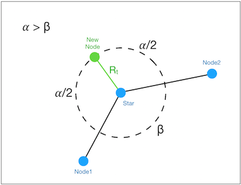
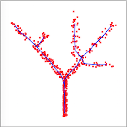
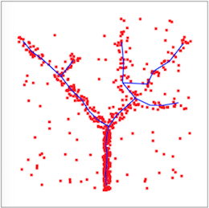
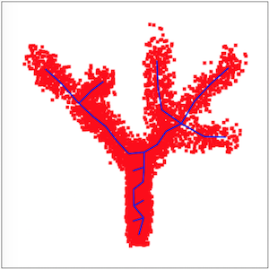
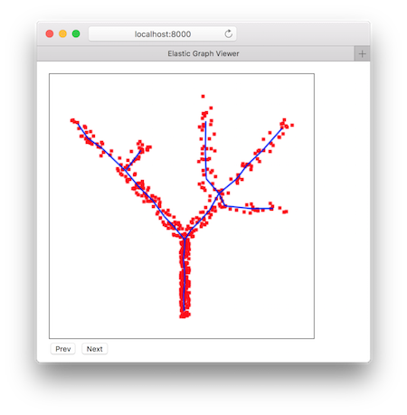

# Robust Elastic Principle Graph

## Introduction

This project is an extreme minimalist implementation in [Scala](https://www.scala-lang.org/) of [Robust Principal Graphs](https://github.com/auranic/Elastic-principal-graphs/wiki/Robust-principal-graphs).


The code is heavily influenced by [VDAOEngine](https://github.com/auranic/VDAOEngine) and this [Applet](http://bioinfo-out.curie.fr/projects/elmap/applet/Master.htm)

2 Grammars are used in this implementation:

- Split Edge
- Add Node

The implementation of splitting an edge is pretty simple. It is the implementation of the second grammar (Add Node) that made me pause. If a node is only added to [star](https://en.wikipedia.org/wiki/Star_(graph_theory)) nodes, then where should the initial location of this new node be with respect to that star node?

The VDAOEngine and the Applet have their own implementations, but wanted to try out an idea that is derived from SOMs, where the radius of influence shrinks over the learning epochs. So, switching to polar coordinates, in this implementation, a node is placed off a star node at a radius distance and that radius distance diminishes with every epoch. With the distance defined, the angle of the new node is the mid angle between the max angle between two consecutive edges. See below picture.



Based on Prof. Zinovyev advise, and after rereading (for the nth time) the [ElPiGraph](https://github.com/auranic/Elastic-principal-graphs/blob/master/ElPiGraph_Methods.pdf) paper, I've adjusted the code to not use the parameters `polarMin` and `polarMax`, and use the mean of the data to the closest star to generate an edge off that star. This is implemented in the `Graph.subGraphs` method. In addition, nodes are also added to leaf nodes based on the opposite direction of their associated stars.

Here are some of the results by varying the noise in the data.

  

## Project Structure

This project is divided into 2 sub projects:

- `elastic-graph-algo`: This sub project implements the elastic graph algorithm and exposes it as an API. It generates a library jar file that can be linked into applications.

- `elastic-graph-main`: This sub project generates an executable jar based on the `elastic-graph-algo` library jar and enables the interaction with the elastic graph algorithm using command line parameters.

### Compile the application

The application is built using [Apache Maven](https://maven.apache.org/)

```bash
mvn clean package
```

This produces the aforementioned jar files (the library and the executor) in each sub project `target` folder.

### Running the application

```bash
cd elastic-graph-main
java\
 -Djava.awt.headless=true\
 -jar target/elastic-graph-main-0.3-jar-with-dependencies.jar\
 --el 0.00015\
 --mu 0.00015\
 --robustDist 0.2\
 --maxNodes 30\
 --inputPath data/tree23_noise.data\
 --outputFormat js\
 --outputPath web/doc.js
```

The above command produces a JavaScript file (`doc.js`) in the `web` folder.  This content of the JavaScript file is a data structure that enables the web viewer application `index.html` to step through each learning epoch.

### View the result in a browser

Start a simple HTTP server using Python in the `web` folder:

```bash
cd web
python -m SimpleHTTPServer 8000
```

Navigate in a browser to [localhost:8000](localhost:8000)

Make sure to refresh the page after each execution to reload the `doc.js` file with the latest results.



### Produce Animated GIF

```bash
java\
 -Djava.awt.headless=true\
 -jar target/elastic-graph-main-0.3-jar-with-dependencies.jar\
 --el 0.00015\
 --mu 0.00015\
 --robustDist 0.2\
 --maxNodes 30\
 --inputPath data/tree23.data\
 --outputFormat gif\
 --outputPath web/eg.gif
```

If the above mentioned web server is running, then navigate to [localhost:8000/eg.gif](localhost:8000/eg.gif)

### Command Line Arguments

| Key | Description | Default Value |
|-----|-------------|---------------|
| --el | Graph elasticity factor | 0.0001 |
| --mu | Graph bending factor | 0.0001 |
| --inputPath | Input data path | data/tree23.data |
| --inputDrop | Number of header lines | 0 |
| --inputSep  | Field separator | tab |
| --inputX    | X field position | 0 |
| --inputY    | Y field position | 1 |
| --maxNodes  | Max nodes of generated graph | 25 |
| --maxStarNodes | Add edges to stars with less than `maxStarNodes` neighbors | 4 |
| --robustDist | Robust distance | 0.2 units |
| --minAngle | A graph is valid if is contains edges that are more than `minAngle` apart | 20 degrees |
| --cutEdgesOnly | Apply only cut edge grammar | false |
| --outputPath | Output path | web/doc.js |
| --outputFormat | Output format, options: `wkt`,`gif`,`js`| js|
| --shuffleTake | Shuffle the input data and take the first n values | -1 (no shuffle and take) |

### Updates

*2018-01-08*: Added `--shuffleTake` as a command line argument.

*2018-01-05*: Added a class to calculate the [directional distribution](http://pro.arcgis.com/en/pro-app/tool-reference/spatial-statistics/h-how-directional-distribution-standard-deviationa.htm) of the data and added a class to maintain a spatial index of the data.
In the main application, the input data is loaded into a spatial index in the form of a grid. The grid cell size is half of the robust distance.
The cell with the most data points is then labeled as the 'center cell'.  A directional distribution is calculated based on the data in the center cell and in all it surrounding cells.  The "major nodes" of the directional distribution ellipse are then used as the initial nodes in the elastic graph construction.

### TODO

- ~~Produce animated GIF of graphs at each training epoch.~~
- ~~Implement directional distance for initial node selection based on the "shape" of the neighborhood of the first point.~~
- Handle multi dimensional input data.
- Perform calculations in GPU as a lot can be done in parallel.

### References

- https://github.com/auranic/Elastic-principal-graphs/wiki
- https://en.wikipedia.org/wiki/Kronecker_product
- http://bioinfo-out.curie.fr/projects/elmap/applet/Master.htm#NLOEM
- https://github.com/scalanlp/breeze
- http://www.baeldung.com/executable-jar-with-maven
- https://gridbyexample.com/
- http://elliot.kroo.net/software/java/GifSequenceWriter/GifSequenceWriter.java
- [PCA In Scala](https://gist.github.com/tyrcho/5884241)
- http://pro.arcgis.com/en/pro-app/tool-reference/spatial-statistics/h-how-directional-distribution-standard-deviationa.htm
